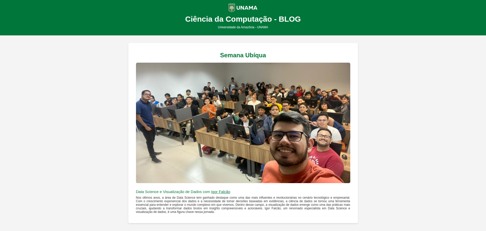
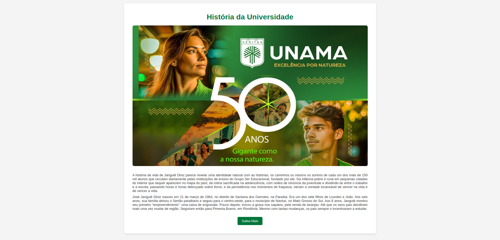
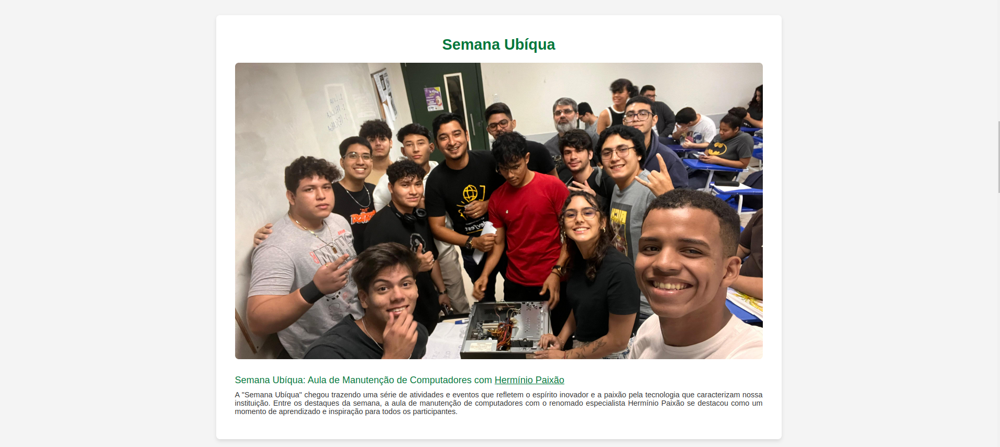
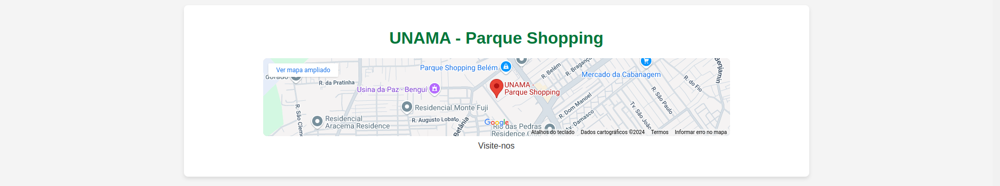
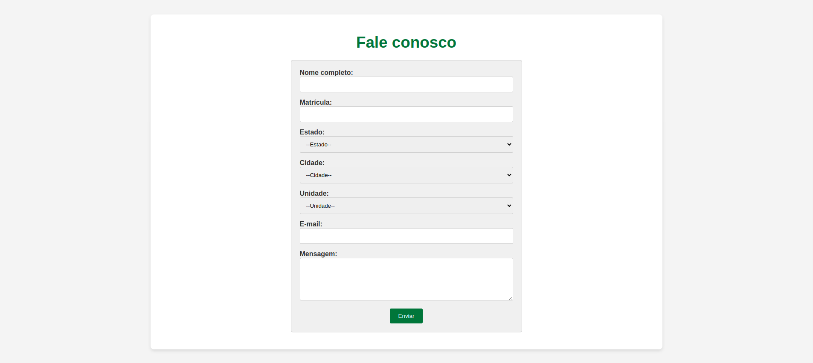

# 🌐 Blog da Ciência da Computação - UNAMA


Bem-vindo ao repositório do Blog da Ciência da Computação da Universidade da Amazônia (UNAMA). Este site oferece informações sobre eventos, cursos e notícias relacionados à área de Ciência da Computação. O blog é uma plataforma para compartilhar informações atualizadas e relevantes para alunos e profissionais da área.

## 📂 Estrutura do Projeto

O projeto é estruturado da seguinte maneira:

- `index.html`: O arquivo principal HTML que contém o conteúdo do blog.
- `styles.css`: O arquivo de estilos CSS para o design da página.

## 📝 Seções do Blog

O blog é dividido em várias seções principais:

1. **Cabeçalho (Header)**:
   - Contém o logo da UNAMA e o título do blog.

2. **Mensagem de Boas-vindas (Welcome Message)**:
   - Detalhes sobre a "Semana Ubíqua" com uma imagem relevante e um destaque para a atividade de Data Science e Visualização de Dados com Igor Falcão.

3. **História da Universidade (University History)**:

   - Apresenta a história do fundador José Janguiê Diniz e informações sobre o Grupo Ser Educacional.

4. **Aula de Manutenção de Computadores (Computer Maintenance Class)**:

   - Informações sobre a aula de manutenção de computadores com o especialista Hermínio Paixão.

5. **Evento de Segurança Cibernética (Sice Sicuryt)**:
   - Detalhes sobre o evento de segurança cibernética promovido pela Devs Norte.

6. **Projeto TechBase**:
   - Informações sobre o projeto TechBase e sua parceria com o Unama Parque Shopping para oferecer cursos de informática básica.

7. **Localização (Location)**:

   - Mapa integrado do local da UNAMA - Parque Shopping.

8. **Formulário de Contato (Contact Form)**:

   - Um formulário para contato com campos para nome, matrícula, estado, cidade, unidade, e-mail e mensagem.

## 🚀 Como Usar

1. **Clonar o Repositório**:
   Para clonar o repositório, use o seguinte comando:
   ```bash
   git clone https://github.com/rafaelgoesti/projeto-php.git
---

# 📊 Relatório do Blog da Universidade da Amazônia (UNAMA)

## 📘 Introdução

O Blog da Universidade da Amazônia (UNAMA) é uma plataforma digital destinada a fornecer informações e atualizações sobre eventos, cursos e notícias relevantes para a comunidade acadêmica e o público em geral. Este relatório fornece um resumo das principais seções e funcionalidades do blog, bem como uma visão geral dos eventos e recursos destacados.

## 🏗️ Estrutura do Blog

### 🏠 Cabeçalho (Header)

- **Logo e Título**: O cabeçalho apresenta o logo da UNAMA e o título do blog, "Ciência da Computação - BLOG", proporcionando uma identificação clara da instituição.
- **Informações da Instituição**: Inclui uma breve descrição da Universidade da Amazônia (UNAMA).

### 📑 Seções Principais

#### 1. **📅 Mensagem de Boas-vindas (Semana Ubíqua)**

- **Data Science e Visualização de Dados**: Destaque para a atividade de Data Science e Visualização de Dados conduzida por Igor Falcão. A seção inclui uma imagem relevante e uma breve descrição sobre a importância da ciência de dados e visualização de dados no cenário atual.

#### 2. **🏛️ História da Universidade**

- **José Janguiê Diniz**: Apresenta a trajetória do fundador do Grupo Ser Educacional, José Janguiê Diniz, desde sua infância até o estabelecimento do grupo educacional. A seção inclui uma imagem histórica e um link para mais detalhes sobre a biografia do fundador.

#### 3. **🛠️ Aula de Manutenção de Computadores**

- **Hermínio Paixão**: Detalha a aula de manutenção de computadores realizada durante a "Semana Ubíqua", conduzida pelo especialista Hermínio Paixão. Esta seção destaca a importância do evento e os tópicos abordados, como manutenção preventiva e técnicas de reparo.

#### 4. **🔒 Evento de Segurança Cibernética (Sice Sicuryt)**

- **Devs Norte**: Descreve o evento de segurança cibernética "Sice Sicuryt", organizado pela Devs Norte. A seção enfatiza a relevância do evento em um ambiente digital em constante evolução e fornece um link para saber mais.

#### 5. **💻 Projeto TechBase**

- **Informática Básica**: Informa sobre o projeto TechBase, uma parceria com o Unama Parque Shopping para oferecer cursos gratuitos de informática básica. Esta seção detalha o objetivo do projeto e como ele beneficia a comunidade.

#### 6. **📍 Localização da UNAMA - Parque Shopping**

- **Mapa Integrado**: Inclui um mapa integrado do local da UNAMA no Parque Shopping, fornecendo informações visuais para visitantes e interessados.

#### 7. **📧 Formulário de Contato**

- **Informações de Contato**: Oferece um formulário para que os visitantes possam entrar em contato com a universidade. Inclui campos para nome, matrícula, estado, cidade, unidade, e-mail e mensagem.

### 📜 Rodapé (Footer)

- **Informações Adicionais**: Contém links úteis, como o [Portal do Aluno](https://aluno.sereduc.com/) e perfis sociais da UNAMA, incluindo Instagram, Facebook e YouTube. 📸👍🎥
- **Direitos Autorais**: Declaração de direitos autorais da Universidade da Amazônia.

## 📈 Análise e Observações

- **Usabilidade e Design**: O blog apresenta um design intuitivo e acessível, com seções bem definidas e conteúdo visualmente atraente. A inclusão de imagens e links diretos melhora a navegação e o acesso à informação.
- **Conteúdo Relevante**: O blog abrange uma variedade de tópicos importantes para a comunidade acadêmica, como eventos, projetos e recursos educativos, contribuindo para o engajamento e a disseminação de informações.
- **Funcionalidades de Contato**: O formulário de contato é uma ferramenta útil para que os visitantes interajam com a universidade, promovendo uma comunicação eficaz.

## 🎯 Conclusão

O Blog da UNAMA serve como uma plataforma essencial para a divulgação de informações e eventos relacionados à universidade. Com uma estrutura clara e conteúdo relevante, o blog atende às necessidades da comunidade acadêmica e do público em geral. O uso de recursos visuais e links para informações adicionais contribui para uma experiência de usuário positiva e engajadora.

---